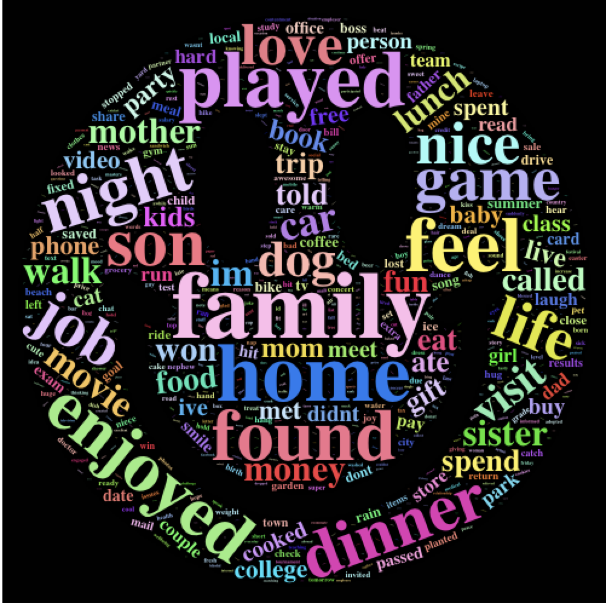

Modren life throw hard on us, people often find themselves struggling everyday. Manage one's negative emotions and being happy is good for one's health both physically and psychologically. In this storybook, I will use the HappyDB dataset to explore the topics that make people feel happy.


#Dataset

HappyDB is a corpus of 100,000 crowd-sourced happy moments. The goal of the corpus is to advance the state of the art of understanding the causes of happiness that can be gleaned from text. Simply stated, HappyDB is a collection of happy moments described by individuals. (cited from dataset description)
```{r load libraries, warning=FALSE, message=FALSE}
#make sure you install all the packages before loading!
library(tidyverse)
library(tidytext)
library(DT)
library(scales)
library(wordcloud2)
library(gridExtra)
library(ngram)
library(dplyr)
library(tm)
library(ggplot2)
library(topicmodels)
library(SnowballC)
library(d3heatmap)
library(syuzhet)
library(knitr)
library(webshot)
library(htmlwidgets)
```

```{r echo=FALSE, fig.width=3, fig.height=20}

```


```{r load data, warning=FALSE, message=FALSE}
#read processed data (cleaned and stemmed)
hm_data <- read_csv("../output/processed_moments.csv")
#load demograpic dataset
urlfile<-'https://raw.githubusercontent.com/rit-public/HappyDB/master/happydb/data/demographic.csv'
demo_data <- read_csv(urlfile)
```

```{r combine data}
#combine preprocessed data and demo_data
hm_data <- hm_data %>%
  inner_join(demo_data, by = "wid") %>%
  select(wid,
         original_hm,
         cleaned_hm,
         predicted_category,
         gender, 
         marital, 
         parenthood,
         reflection_period,
         age, 
         country, 
         ground_truth_category, 
         text) %>%
  mutate(count = sapply(hm_data$text, wordcount)) %>%
  filter(gender %in% c("m", "f")) %>%
  filter(marital %in% c("single", "married")) %>%
  filter(parenthood %in% c("n", "y")) %>%
  filter(reflection_period %in% c("24h", "3m")) %>%
  mutate(reflection_period = fct_recode(reflection_period, months_3 = "3m", hours_24 = "24h"))

 
```
#What are the frequent words people use to describe their happiness?
Prehaps the most stright forward or probably the best way to look for happiness is to see how others describe their experience. The wordcloud pictures\ below shows what are essential words for happiness including: family, friends, love, home, life, son, food, night, event etc.

It is easy to observe family, friendship, love are three main topics of happiness, therefore for being happy, it could be helpful to do the following:

1) Spend more time with others who are either your family members(wife, kids, parents or siblings) or friends.

2) Show love to the people around you.

3) Learn to enjoy things around, such as food, night or go out for a movie

```{r wordcloud2}
#calculated the word frequency
words<-strsplit(hm_data$text," ")
words.freq<-table(unlist(words));
freq<-sort(words.freq,decreasing = TRUE)
freq<-data.frame(word = names(freq),freq =as.numeric(freq))
#build wordcloud to give a strightfoward and fancy presentation
figPath<- "../figs/Happy.png"
pic<-wordcloud2(data=freq, figPath = figPath, size = 1,color = "random-light",backgroundColor = "black")

```

```{r echo=FALSE, fig.width=3, fig.height=20}

```

#Which group of people is happier in life?

After learning what are the words that people used in happy statement, it is also very interesting to look at which group of people is more happier in life.

Fun facts:

1) BEFORE marriage, Male respondents make way more happy statements than female respondents.

2) AFTER marriage, Male respondents make approximately the same amount of the happy statements as female respondents.

Interpretation: 

From the bar chart below, it is obvious that there are significanltly more happy statements are made by single male respondents  than married male and the number of happy statements made by female repondent are slightly increased after marriage. 

So should man avoid marriage? No!!!

It is fairly easy to misunderstand the graph and concluded that married man needs to manage more anxiety problems, wrangle by more responsibilities and feel significantly less happy than their are single before since this is not a fixed group of scientific experienment. However, if you checked the wordcloud before, the word Wife, Family, Kids, Home and ect are mentioned regularly in happy statements which indicates that marriage is actually a main source of happiness.


```{r happy moments by gender}
#plot happy moments based on marital status and gender.
red.bold.italic.text <- element_text(face = "bold.italic", color = "red",size = 15)
g_num<-ggplot(hm_data, aes(marital))
g_num+geom_bar(aes(fill = gender),position = position_stack(reverse = TRUE)) +
  coord_flip() +
  labs(title = "Who is Happier?", x = "Marital Status", y = "Count")+
  theme(legend.position = "bottom",title = red.bold.italic.text, axis.title = red.bold.italic.text, plot.title = element_text(hjust = 0.5))
```
#Is Happiness Influenced by different season?

The answer is Yes in some circunstance. Based on the bar chart below, people mentions SUMMER most frequent and WINTER least in their happy statements. This is quite intuitive, summer is the hot season for both outdoor activities and vacation which will bring happiness to everyone, on the other hand, winter is a less popular season for sightseeing and people tend to stay inactive during winter. 

However, this is not so true due to two reasons:

1) Only 1.5k happy text mentions season factors among a total 580k happy words, which means the season sample is insignificant. 

2) From the wordcloud, there is no distinquishable relationships between different seasons and other frequent happy words.

Overall, peopel does react different from being in different seasons. But the answer if season is a significant variable in predict happiness is doutable.

```{r happiest season}
#count the happiest season 
seasons<-c("spring","summer","fall","winter")
count<-c()
for (i in 1:length(seasons)){
  count[i] <- freq[freq$word==seasons[i],]$freq
}
season_count<-data.frame(seasons,count)
#plot happy moments vs season
s_num<-ggplot(season_count,aes(x=seasons,y=count, fill=seasons))
s_num+geom_bar(stat = "identity")+labs(title="Happiest Season")+ theme(legend.position = "bottom",title = red.bold.italic.text, axis.title = red.bold.italic.text, plot.title = element_text(hjust = 0.5))
```
#Effect of gender and marriage on happy categories

The following below is a heat map of happy categories that identified by the dataset which includes:

1) Affection

2) Achievement

3) Enjoy the moment

4) bonding

5) Leisure

6) Nature

7) Exercise

From the heat map, it shows affection and achievement are the major two categoies that makev people feel happy. It is quite reasonable since human are socail animals, what can bring more happiness to us than affection and achievenment. There are slight. Are female more emotional than male since they express more happiness on affection? It is hard to say since the groups are not fixed so the difference can't really tell the truth.

For married people, affection outweighted achievement. This is a expected result since married people express more affection or love than single person. Again, this heatmap show that people derive more happiness from social or more specificly, being in a relathionship.


```{r}
# caculate the effect of gender on happy categories
predict_category<-unique(hm_data$predicted_category)
Male<-c(rep(0,7))
Female<-c(rep(0,7))
Single<-c(rep(0,7))
Married<-c(rep(0,7))

df_category<-data.frame(Male,Female,Single,Married,row.names = predict_category)
for(i in 1:length(predict_category)){
  df_category$Male[i]<-sum(hm_data[hm_data$gender=="m",]$predicted_category == predict_category[i])
  df_category$Female[i]<-sum(hm_data[hm_data$gender=="f",]$predicted_category == predict_category[i])
  df_category$Single[i]<-sum(hm_data[hm_data$marital=="single",]$predicted_category == predict_category[i])
  df_category$Married[i]<-sum(hm_data[hm_data$marital=="married",]$predicted_category == predict_category[i])
}
d3heatmap(df_category,scale = "column",colors = "Blues")
```
#Are people enjoy different topics based on marital status or parenthood?
#Supervised topic modeling with TF-IDF

Enough broad analysis on source of happiness, now lets look at more specific topics. Here I used supervised topic modeling with TF-IDF to explore the specific topics that can arouse happiness from people based on their married status and parenthood. This is more like a check on one's intuition.

```{r}
#I am creating a function that can do suprevised modeling using TF-IDF("term frequency-inverse document frequency") method. TF-IDF can help identify words that are common in specifict documents(we assume they are important) and words that are common in all documents(we assume words that shows in all documents aren't important).

#The function takes in a dataframe, the name of the column that has the texts and the name of the column that has the topic labels(gender,marital etc.)in it.

top_terms_by_topic_tfidf <- function(text_df, text_column, group_column, plot = T){
  group_column <- enquo(group_column)
  text_column <- enquo(text_column)
  
  # get the count of each word in each review
  words <- text_df %>%
    unnest_tokens(word, !!text_column) %>%
    count(!!group_column, word) %>% 
    ungroup()
  # get the number of words per text
  total_words <- words %>% 
    group_by(!!group_column) %>% 
    summarize(total = sum(n))
  
  # combine the two dataframes we just made
  words <- left_join(words, total_words)
  
  # get the tf_idf & order the words by degree of relevence
  tf_idf <- words %>%
    bind_tf_idf(word, !!group_column, n) %>%
    select(-total) %>%
    arrange(desc(tf_idf)) %>%
    mutate(word = factor(word, levels = rev(unique(word))))
  
  if(plot == T){
    # convert "group" into a quote of a name
    group_name <- quo_name(group_column)
    tf_idf %>% 
      group_by(!!group_column) %>% 
      top_n(10) %>% 
      ungroup %>%
      ggplot(aes(word, tf_idf, fill = as.factor(group_name))) +
      geom_col(show.legend = FALSE) +
      labs(x = NULL, y = "tf-idf") +
      facet_wrap(reformulate(group_name), scales = "free") +
      coord_flip()
  }else{
    # return the entire tf_idf dataframe
    return(tf_idf)
  }
}
```
The first plot below is a perfect example of how parents enjoy differnt things than non-parent. 

1)For parents, topics are more narrowed and related to family than non-parent candidate, words such as grandchildren, daddyrest or dada are more frequently appeared. 

2)For non-parents, topics are more diversed but all towards to entertainment which includes: Twitch(vedio streaming website), Tinder(social network app), cosmopolitan(diversed culture), wifi(Internet surfing), etc.
```{r}
#explore things that make people happy based on parenthood status
top_terms_by_topic_tfidf(text_df = hm_data,
                         text_column = text,
                         group_column = parenthood,
                         plot = TRUE)
```
The second plot differentiate the gap in topics between married status.

1) For married group, common words include: hungary, thekkday, munner, etc. These are all sightseeing locations and indicate that traveling is a major topic for married people when they pursue happiness.

2) For single people, topics are varied and include: Deadlift(exercise), Ebook & Manga(Reading habit), fratenity(social), hotelparkcinema(entertainment). 
```{r}
#explore things that make people happy based on marital status
top_terms_by_topic_tfidf(text_df = hm_data,
                         text_column = text,
                         group_column = marital,
                         plot = TRUE)
```
In conclusion: Topic modeling presents very intuitive results for the search of happiness. Parents ususally spend more time with kids and family so they express more happiness with family. On the other hand, non-parents uses more time on social or practice habits, therefore, they derive happiness from different sources. Married people normally express less personalities and sacrifice more personal time since they have a family to raise and need to prepare for the future, therefore, topics about vacation or travel location become their major happy source. Unlike married people, singles use more time on themselves, such as doing exercise, read books, playing tinder or looking for entertainment. Overall, what doesn't change is that socialization is an enternal topic of happiness.

#Does happiness conditional on demographic?
#Sentiment analysis based on Age.

Finally, we have a counter intuitive result. Most of us believe “grass is always greener” with respect to happiness. Young folks anticipate to grow up, chase for freedom, build a happy career and family later on in life. Older people reminisce about a time when they were young and adventurous, saying they will risk anything to become young again. We all believe that some other stage of our life will bring us more joy. 

Sentiment analysis is a test to weighs the emotional intensity of text. I used R package "Syuzhet" to measure the sentiment of these happy experiences to determine how their intensities vary. 
```{r}
#Sentimental analysis based on different Age
twenties <- hm_data[which(hm_data$age>=20 & hm_data$age<30),"text"]
thirties <-hm_data[which(hm_data$age >=30 & hm_data$age<40),"text"]
forties <-hm_data[which(hm_data$age >=40 & hm_data$age<50),"text"]
fifties <-hm_data[which(hm_data$age >=50& hm_data$age<60),"text"]
sixties <-hm_data[which(hm_data$age >=60 & hm_data$age<70),"text"]
seventyup <-hm_data[which(hm_data$age >=70),"text"]


sv20<-get_sentiment(twenties$text, method = "nrc")
sv30<-get_sentiment(thirties$text, method = "nrc")
sv40<-get_sentiment(forties$text, method = "nrc")
sv50<-get_sentiment(fifties$text, method = "nrc")
sv60<-get_sentiment(sixties$text, method = "nrc")
sv70up<-get_sentiment(seventyup$text, method = "nrc")

sentiment_values<-list(sv20,sv30,sv40,sv50,sv60,sv70up)
names(sentiment_values)<-c("20s","30s","40s","50s","60s","70s+")
boxplot(sentiment_values,ylim=c(-10, 20),ylab="Sentiment of Experiences",xlab  = "Sentiment of Happy Experience by Age")

```
Surprisingly, there’s unidentifiable change in the spread of happy experiences across the age demographic groups. Here are the highlights:

1) Since it is a happiness database, overall, the experiences are definitely positive. But the bottom quartile does have negative sentiment (Great joy comes with great tragedy)

2) The difference between age group is barely noticeable. and the quantiles are virtually identical.

3) The number of extreme points indicate young people does express emotion more intense than old folks both positively and negatively.

In sume, although, the dataset does not include other features such as race, social or wealth status, there is no significant difference in the range of happy experiences reported by different demographics.


#Wrapping up

The methods used in this story are imprefect obviously, which may contain personal bias against what is real behind the dataset, but still represent the fundation of daily happiness for lots of up given that we are more alike than we often thought because we are from the same race.

Textual data is remains messy after modification and I don’t think about happiness in clearly defined categories of experience. But, the ideas in this story book is still a good example for understanding positivity in our everyday lives, I think it can help remind us that happiness is never so far off as we may think.

I believe many of these happy topics to be true on some level since they are very intuitive and empirically-certified. Therefore, we should take what we can get and hope you will like what I find.


